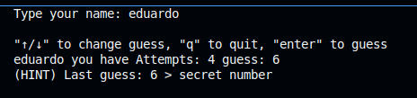

# 🎯 Guessing Game (CLI Edition)

A fun and interactive number guessing game built with [Go](https://golang.org) and [Bubble Tea](https://github.com/charmbracelet/bubbletea).

> **Objective**: Learn the basics of the Go programming language by building a simple but interactive command-line project.



---

## 🚀 Features

- Number guessing game logic with adjustable input
- TUI interface using Bubble Tea
- Replay option
- Clean and modular Go structure

---

## 🧰 Technologies

- [Go](https://golang.org) (standard library)
- [Bubble Tea](https://github.com/charmbracelet/bubbletea)

---

## 📦 Run the game

```bash
go run main.go
